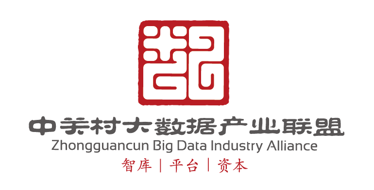

 
 

##### **[简 介]**

2016年1月28日，中关村大数据产业联盟数据交换标准委员会在北京成立。

委员会隶属于中关村大数据产业联盟，并提供开源的大数据交换流通平台DataHub([https://hub.dataos.io](https://hub.dataos.io))，共同致力于搭建开放的数据互联网络，促进跨行业的数据流通合作，

推动行业大数据创新应用场景的落地,为大数据交换标准和行业大数据应用规范体系的建立做出贡献。
        

##### **[使 命]**

 - 聚合数据资源

 - 搭建联接平台

 - 促进数据流通

 - 制定交换标准

 - 规范数据管理

