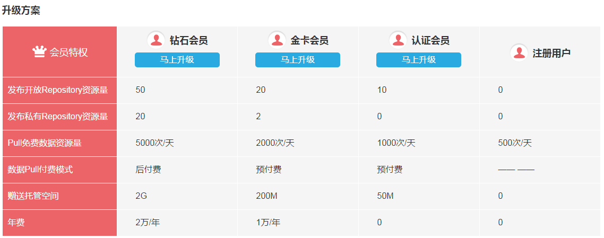
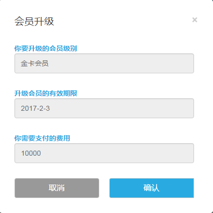

**会员级别**

DataHub 平台的会员级别分为四级，分别是：
1. 注册用户
2. 认证会员
3. 金卡会员
4. 钻石会员

不同级别的会员拥有不同的会员特权，升级为金卡会员、钻石会员，可以获得数据托管空间、发布私有数据等资源量。

**会员升级**

**第一步：网站注册**

请前往 DataHub 平台：[https://hub.dataos.io](https://hub.dataos.io) 进行用户注册。完成此步后您将成为注册用户。

**第二步：会员认证**

请前往“会员升级”页面，根据页面提示完成会员信息提交及认证审核。完成此步后您将成为认证会员。

**第三步：会员升级**

1）进入 DataHub 平台的“个人中心”-“会员升级”页面。

2）选择“金卡会员”或“钻石会员”，点击相应的“马上升级”，确认升级的会员级别。

3）根据提示发送您的升级需求到 datahub@asiainfo.com ，我们会在三个工作日内回复您。

4）收到您发送的升级需求后， DataHub 会安排工作人员协助您完成费用支付及会员升级工作。完成升级后，您会收到邮件和站内消息通知。您还可以前往“个人中心”-“基本信息”页面中查看升级后的会员级别和资源状态。
