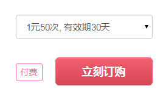
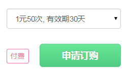
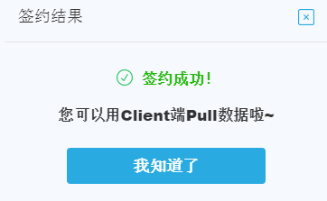
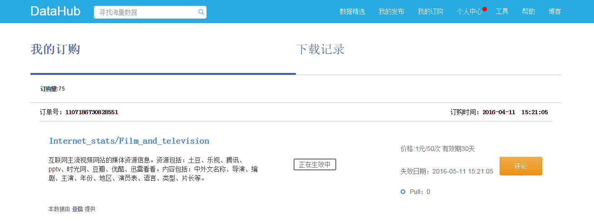

DataHub 提供的数据类型包括：批量数据、 API 数据和流式数据。

数据 pull 是数据需求方的行为，需要在网页端和 Client 客户端分步操作。在网页端您可以完成数据的"立刻订购"或"申请订购"，而 pull 数据则需要通过 Client 客户端来完成。

**第一步：订购数据（网页端操作）**

1）进入 DataHub 网站，查看、搜索 Repo 、 Item 后，选择需要订购的数据，根据数据提供方设定的不同权限，点击“立刻订购”或“申请订购”。

  
2）签订数据订购合约。甲方为数据需求方，乙方为数据提供方。

 
3）查看签约结果。订购成功后，可立即在 Client 客户端开始 pull 数据。

 
4）您可以在“我的订购”中查看全部的订单信息。

 
**第二步：数据pull（Client客户端操作）**

1）创建 Datapool

如果需要 pull 数据，则必须创建相应的 Datapool 。

	datahub dp create mydp file:///home/usr/data/itempull

以上命令创建了一个名为 mydp 的 Datapool ，类型是 file ，路径是`/home/myusr/data/itempull , 用于存储即将 pull 的数据。

如果成功，会显示：

	datapool create success, name: mydp type:file path:/home/myusr/data/itempull

2）数据 pull

	datahub pull repotest/itemtest:tagtest mydp://mydir1 -d tagdestname.txt

以上命令 pull 了一个 Tag 对应的数据到 mydp 中，子路径是 mydir1 。

如果成功，会显示：

	repotest/itemtest:tagtest will be pulled into /home/myusr/data/itempull/repotest_itemtest/mydir1

在该文件夹下，您将会看到已经 pull 到本地的 tagdestname.txt 文件。

**数据 pull 注意事项：**

1） Client 客户端的安装，请参见“ DataHub 客户端”-“ DataHub 客户端安装方法”小节。

2）“申请订购”需等待数据提供方批准，批准后数据需求方才可在 Client 客户端开始 pull 数据。在数据提供方批准前，数据需求方可在 Item 详情页点击“取消订购”，撤销“申请订购”。
