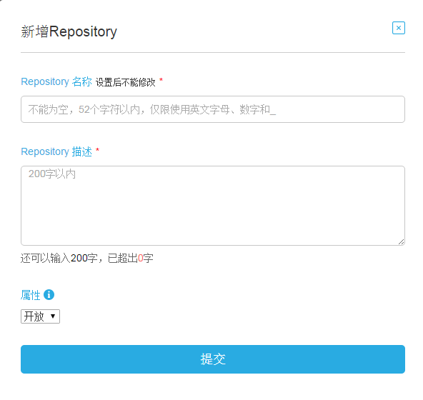
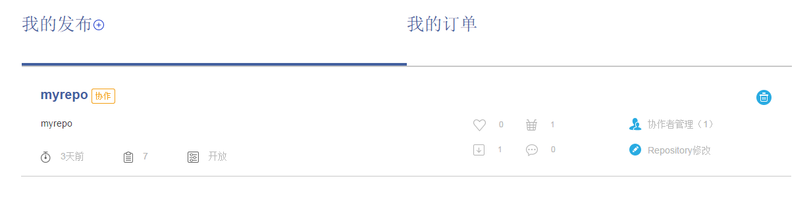
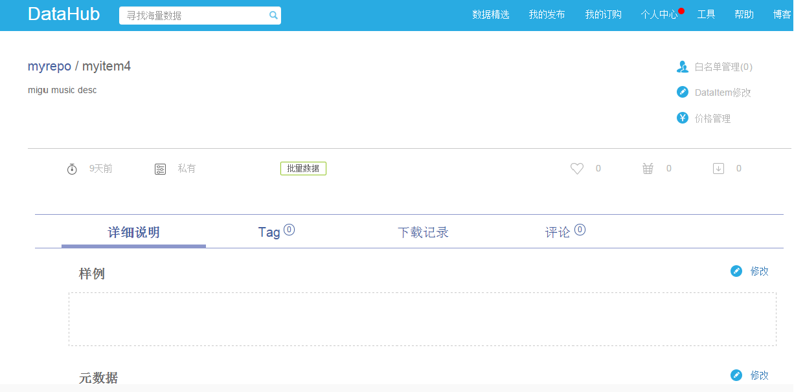
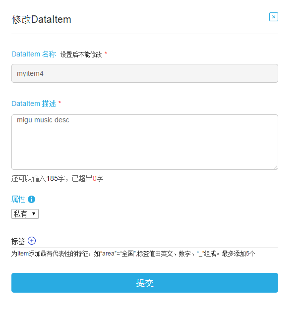
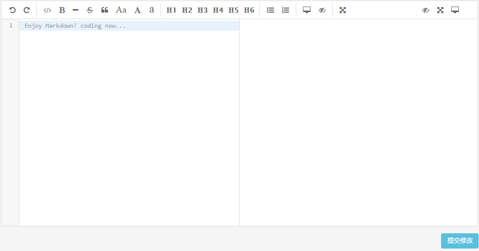

数据发布是数据提供方的行为，需要在网页端和 Client 客户端分步操作。在网页端您可以完成：新增私有\开放 Repo 、修改私有\开放 Repo 、修改私有\开放 Item ，而新增私有\开放 Item 、新增 Tag 等则需要通过 Client 客户端来完成。

**第一步：新增 Repo （网页端操作）**

1）如果您是认证用户，登录之后，您可以开始发布数据了。进入 DataHub 平台“我的发布”，或者直接输入网址：[https://hub.dataos.io/myPublish.html](https://hub.dataos.io/myPublish.html)

2）在“我的发布”页面，选择开放或私有 Repository （新建私有 Repo 需要会员级别是钻石会员或金卡会员）

3）在弹出的“新增 Repo ”的设置页面，填写 Repo 的名称、描述和属性。

4）填写信息提交后，我的发布页面将出现新的 Repo 信息。

**第二步：新增 Item （ Client 客户端操作）**

假设在 `/home/myusr/data/topub` 目录下存在若干文件，我们要发布这个目录里面的数据。

1）创建 Datapool

数据提供方使用 Client 客户端发布 Item 前，需要在本地基于已有数据建立一个 Datapool ，发布这个 Datapool 里面的数据。

	datahub dp create mydp file:///home/myusr/data

以上命令创建了一个名为 mydp 的 Datapool ，类型是 file ，路径是 /home/myusr/data 。

如果成功，会显示：

	datapool create success, name: mydp type:file path:/home/myusr/data

2）新增 Item

发布 Item 需要指定 DATAPOOL 和 DATAPOOL 下的子路径 LOCATION , 可选参数 --accesstype, -t= 指定 Item 属性：public, private, 默认 private，可选参数 --comment, -m=

	datahub pub myrepo/myitem mydp://topub --accesstype=public --comment="my test item"
    

以上命令发布了一个名称为 myitem 的 Item ，所属 Repo 是 myrepo ，对应 mydp 的子目录 topub ，即待发布数据存在于 `/home/myusr/data/topub` 中。

如果成功，会显示：

	Pub success, OK

3）补充 Item 信息

您可以选择在网页端或 Client 客户端对 Item 的信息进行补充。

（1）在网页端补充 Item 信息

选择 Item 修改，或样例、元数据修改。

修改 Item 页面：

修改样例或元数据页面：

 
（2）在 Client 客户端补充 Item 信息

在发布 Item 之前，可以在其对应的目录里创建、编译三个文件： sample.md 、 meta.md 、 price.cfg ，这三个文件的作用分别是：
* sample.md 用于保存 Markdown 格式的样例数据，如果没有此文件，程序会读取此目录下的一个 Tag 文件的前十行，作为样例数据，发布到 Item 的详情里。
* meta.md 用于保存 Markdown 格式的元数据。
* price.cfg 用于保存 JSON 格式的资费计划，用来明确此 Item 的资费。

格式如下：

    {
    	"price":[
    				{
                    	"times":10,
                        "money": 5,
                        "expire":30
                    },
                    {
                    	"times": 100,
                        "money": 45,
                        "expire":30
                    },
                    {
                    	"times":500,
                        "money": 400,
                        "expire":30
                    }
                ]
    }

其中 times 代表可 pull 次数， money 代表价格， expire 代表有效期。

**第三步：新增Tags（Client客户端操作）**

1）发布 Tag 必须指定 TAGDETAIL ,用来指定 Tag 对应文件名，该文件必须存在于 $DATAPOOL://$LOCATION 内，可选参数 --comment, -m=

	datahub pub myrepo/myitem:mytag test.txt

以上命令发布了一个名称为 mytag 的 Tag，所属 Item 是 myitem，对应的数据文件是 `/home/myusr/data/topub/test.txt`。

如果成功，会显示：

	Pub success, OK

**数据发布注意事项：**

1） Client 客户端的安装，请参见“ DataHub 客户端”-“ DataHub 客户端安装方法”小节。

2） Markdown 格式的语法，可参见 [http://www.markdown.cn/](http://www.markdown.cn/) 。

3）资费计划说明。价格属性包括免费、付费、限量试用。不填价格默认数据免费，每个 item 最多可录入 6 种价格。若为批量、 API 数据，则为 xx 元 = 50 次 ， xx 天有效期，若为流式数据，则为 xx 元 = xx 天， xx 天有效。
